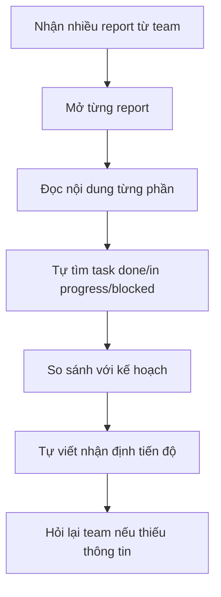
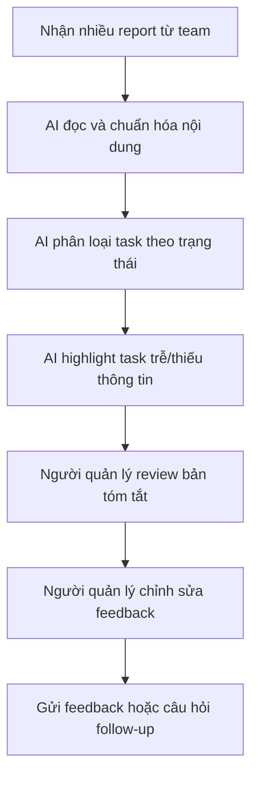
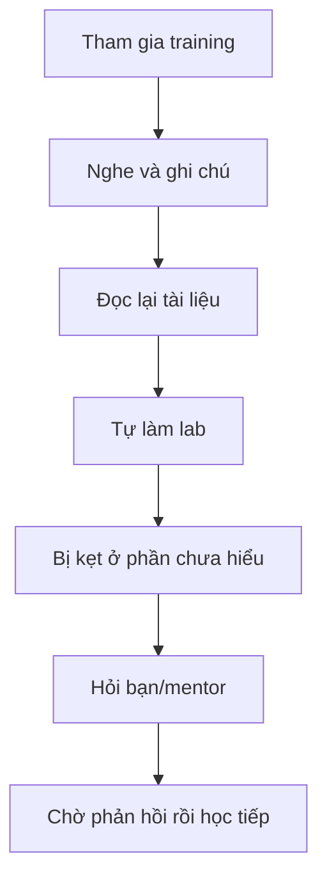
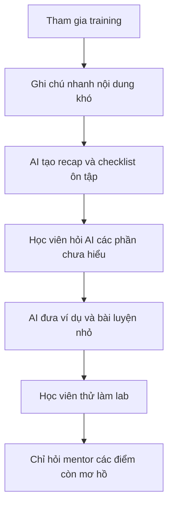
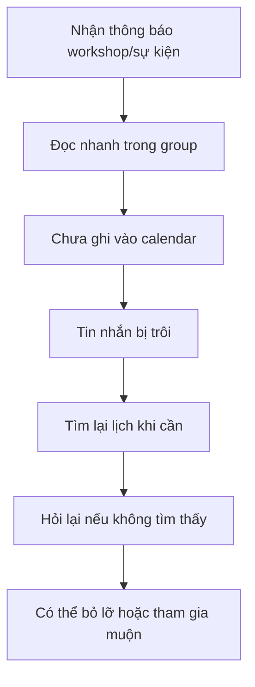
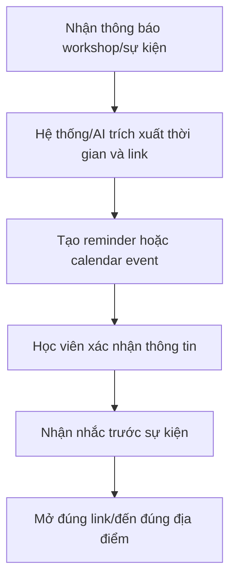

 # Individual Problem Scan — Nguyễn Tấn Hoàng

## Phase 1 — Tìm 5+ problems

| # | Lăng kính | Problem quan sát được | Ai chịu ảnh hưởng? (actor) | Dấu hiệu thật |
|---:|---|---|---|---|
| 1 | Tốn thời gian | Tôi tốn nhiều thời gian đọc report của team dự án để đánh giá tiến độ làm việc và mức độ hoàn thành công việc của team. | Người quản lý/mentor/team lead cần theo dõi tiến độ dự án | Mỗi lần muốn biết team đang ở đâu phải đọc nhiều report thủ công, tự tổng hợp task đã xong, task trễ và phần còn thiếu trước khi đánh giá. |
| 2 | AI có thể hỗ trợ tốt hơn | Có quá nhiều thông tin về cuộc thi Build Phase của AI20K, cần một trợ lý AI hỗ trợ xử lý và tra cứu thông tin nhanh hơn. | Người tham gia AI20K Build Phase | Thông tin về timeline, yêu cầu, hướng dẫn, tiêu chí và tài liệu chương trình nằm ở nhiều nguồn; khi cần trả lời một câu hỏi cụ thể phải tự tìm lại trong nhiều nội dung khác nhau. |
| 3 | Khó khăn đến từ người khác | Group có quá nhiều tin nhắn nên các thông báo quan trọng dễ bị trôi, người học có thể bỏ lỡ việc cần làm. | Thành viên trong group học tập/dự án | Khi group hoạt động liên tục, tin nhắn mới đẩy các thông báo cũ xuống dưới; muốn tìm lại deadline, link hoặc cập nhật quan trọng phải kéo và search thủ công. |
| 4 | Tốn thời gian + AI có thể hỗ trợ tốt hơn | Tôi chưa hiểu và không theo kịp chương trình training, đặc biệt khi nội dung mới đến nhanh hơn khả năng tự hệ thống lại. | Học viên tham gia chương trình training | Sau buổi học vẫn cần đọc lại tài liệu, hỏi lại bạn/mentor hoặc xem lại nội dung để hiểu yêu cầu; nếu lỡ một phần thì các phần sau khó theo kịp hơn. |
| 5 | Lặp lại + Khó khăn đến từ người khác | Tôi hay quên lịch workshop và các sự kiện của chương trình học tập K20. | Học viên K20 tham gia workshop/sự kiện | Lịch có thể xuất hiện trong nhiều kênh như group chat, thông báo, calendar hoặc tài liệu; nếu không tự ghi lại và nhắc lại, dễ bỏ sót thời gian, địa điểm hoặc link tham gia. |

## Ghi chú bằng chứng

- Các problem trên xuất phát từ trải nghiệm cá nhân trong quá trình học, làm dự án và theo dõi thông tin chương trình.
- Mỗi problem đã có actor cụ thể và dấu hiệu quan sát được.
- Chưa dùng số liệu thời gian/tần suất chính xác vì cần đo thêm trong bước validation sau.

## Phase 2 — Top 3 Problem Cards + draft workflow

## Chọn top 3

| Rank | Problem | Vì sao chọn | Điều còn chưa chắc |
|---:|---|---|---|
| 1 | Tốn nhiều thời gian đọc report của team dự án để đánh giá tiến độ làm việc và hoàn thành của team | Actor rõ, workflow hiện tại có nhiều bước thủ công, bottleneck nằm ở bước đọc và tổng hợp report. | Cần đo chính xác mỗi lần mất bao lâu và report thường nằm ở những nguồn nào. |
| 2 | Chưa hiểu và không theo kịp chương trình training | Impact trực tiếp đến kết quả học tập; có thể vẽ workflow từ lúc nhận nội dung đến lúc tự học lại. | Cần xác định phần nào khó nhất: tốc độ giảng, tài liệu, bài tập hay thiếu người giải thích. |
| 3 | Quên các lịch workshop, sự kiện của chương trình học tập K20 | Problem xảy ra lặp lại, có actor rõ, có thể đo bằng số lần bỏ lỡ hoặc phải hỏi lại lịch. | Cần biết lịch đang được thông báo chủ yếu qua kênh nào và có calendar chính thức chưa. |

## Problem Card #1 — Đọc report team dự án

Problem 1 câu: Tôi tốn nhiều thời gian đọc nhiều report của team dự án để đánh giá tiến độ làm việc và mức độ hoàn thành của team.

Actor: Người quản lý/mentor/team lead cần theo dõi tiến độ dự án.

Thời điểm / bối cảnh: Khi cần review tiến độ hằng ngày hoặc hằng tuần, trước buổi check-in hoặc trước khi đưa feedback cho team.

Current workflow 3-7 bước:

1. Mở các report/cập nhật từ từng thành viên hoặc từng nhóm.
2. Đọc từng report để tìm việc đã hoàn thành, việc đang làm và việc bị chậm.
3. So sánh nội dung report với kế hoạch hoặc deadline ban đầu.
4. Tự tổng hợp thành nhận định chung về tiến độ team.
5. Ghi lại điểm cần hỏi thêm hoặc feedback cho team.
6. Trao đổi lại với team nếu report thiếu thông tin hoặc chưa rõ trạng thái.

Bottleneck: Bước đọc và tổng hợp thủ công từ nhiều report, vì thông tin không cùng format và phải tự suy luận trạng thái tiến độ.

Impact: Mất thời gian trước mỗi lần đánh giá, dễ bỏ sót task trễ hoặc hiểu sai mức độ hoàn thành nếu report viết không rõ.

Success metric: Giảm thời gian tổng hợp tiến độ mỗi lần review; tăng tỷ lệ task có trạng thái rõ ràng như done/in progress/blocked/late.

Non-AI alternative: Chuẩn hóa template report, dùng bảng tracking chung, yêu cầu mỗi team cập nhật status theo checklist cố định.

AI hypothesis: AI có thể đọc nhiều report, tóm tắt tiến độ, phân loại task theo trạng thái, phát hiện điểm thiếu thông tin và gợi ý câu hỏi follow-up.

Quick gut:
[ ] No AI / process fix
[ ] Rule
[ ] Workflow
[x] Agent
[ ] Chưa biết

Draft workflow trước:

Draft workflow sau:

## Problem Card #2 — Không theo kịp training

Problem 1 câu: Tôi chưa hiểu và không theo kịp chương trình training khi nội dung mới đến nhanh hơn khả năng tự hệ thống lại.

Actor: Học viên tham gia chương trình training.

Thời điểm / bối cảnh: Sau buổi học, khi làm bài lab, hoặc khi cần áp dụng kiến thức mới vào dự án.

Current workflow 3-7 bước:

1. Tham gia buổi training và nghe nội dung mới.
2. Ghi chú lại các điểm quan trọng nhưng có thể chưa đầy đủ.
3. Đọc lại tài liệu hoặc slide sau buổi học.
4. Tự thử làm bài tập/lab để kiểm tra mình hiểu đến đâu.
5. Khi gặp phần khó, hỏi bạn học hoặc mentor.
6. Chờ phản hồi rồi tự sửa lại cách hiểu.
7. Chuyển sang nội dung mới dù phần trước có thể chưa chắc.

Bottleneck: Bước tự hệ thống lại kiến thức sau buổi học, vì không phải lúc nào cũng biết mình đang thiếu khái niệm nào hoặc nên hỏi câu gì.

Impact: Dễ bị hổng kiến thức, mất nhiều thời gian làm bài lab, giảm tự tin khi tham gia training và khó áp dụng vào dự án.

Success metric: Giảm số phần chưa hiểu sau mỗi buổi học; tăng tỷ lệ hoàn thành bài lab đúng hạn; giảm số lần phải hỏi lại các ý đã có trong tài liệu.

Non-AI alternative: Tạo study group, có mentor office hour, chia tài liệu thành checklist nhỏ, làm recap cuối buổi.

AI hypothesis: AI có thể tóm tắt bài học theo mức hiểu hiện tại, giải thích lại bằng ví dụ đơn giản, tạo checklist ôn tập và gợi ý câu hỏi nên hỏi mentor.

Quick gut:
[ ] No AI / process fix
[ ] Rule
[x] Workflow
[ ] Agent
[ ] Chưa biết

Draft workflow trước:

Draft workflow sau:

## Problem Card #3 — Quên lịch workshop/sự kiện K20

Problem 1 câu: Tôi hay quên lịch workshop và các sự kiện của chương trình học tập K20 vì thông tin lịch nằm rải rác ở nhiều kênh.

Actor: Học viên K20 tham gia workshop và sự kiện học tập.

Thời điểm / bối cảnh: Khi chương trình gửi thông báo workshop, deadline, sự kiện hoặc link tham gia qua group/chat/tài liệu.

Current workflow 3-7 bước:

1. Nhận thông báo lịch từ group chat, tài liệu hoặc kênh chương trình.
2. Đọc nhanh thông báo nhưng chưa chắc ghi lại ngay.
3. Tin nhắn mới đẩy thông báo cũ xuống dưới.
4. Khi gần tới sự kiện, phải tìm lại lịch, địa điểm hoặc link tham gia.
5. Nếu không tìm được, hỏi lại bạn học hoặc người phụ trách.
6. Tự thêm lịch vào calendar nếu còn nhớ.

Bottleneck: Bước ghi nhớ và lưu lịch thủ công, vì thông báo không tự chuyển thành nhắc lịch cá nhân.

Impact: Dễ bỏ lỡ workshop/sự kiện, đến muộn, hỏi lại thông tin nhiều lần hoặc mất thời gian tìm lại link tham gia.

Success metric: Giảm số lần quên hoặc hỏi lại lịch; tăng tỷ lệ sự kiện được thêm vào calendar cá nhân trước thời điểm diễn ra.

Non-AI alternative: Dùng Google Calendar chung, pin thông báo trong group, gửi lịch định kỳ theo tuần, tạo checklist sự kiện.

AI hypothesis: AI có thể đọc thông báo lịch, trích xuất thời gian/địa điểm/link, tạo reminder cá nhân và nhắc lại trước sự kiện.

Quick gut:
[ ] No AI / process fix
[x] Rule
[ ] Workflow
[ ] Agent
[ ] Chưa biết

Draft workflow trước:

Draft workflow sau:

