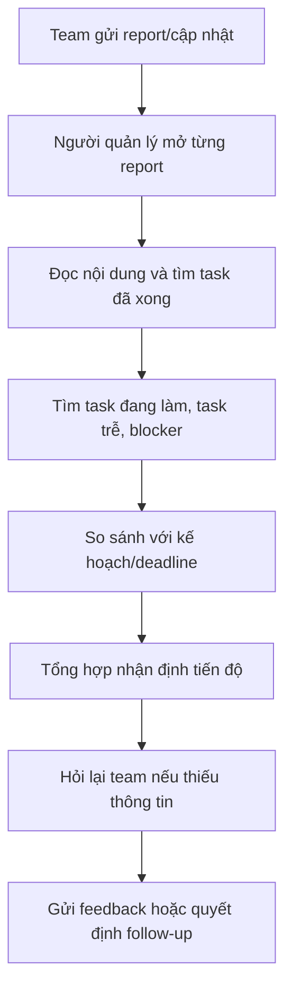
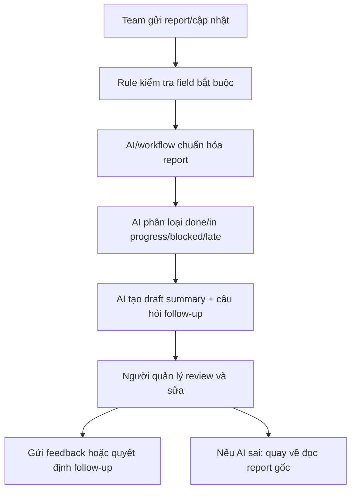

# Group Report — Day 02

## Thành viên nhóm

| STT | Họ và tên | Mã học viên | Vai trò trong nhóm |
|-----|-----------|-------------|--------------------|
| 1   | Nguyễn Tấn Hoàng |             | Đưa candidate, validation/research, workflow, Problem Statement |
| 2   |           |             |                    |
| 3   |           |             |                    |
| 4   |           |             |                    |
| 5   |           |             |                    |

## Phase 3 — Hội tụ nhóm và chọn candidate problem

### Bước 3.1 — Trình bày top 3

| # | Người đưa ra | Candidate problem | Người gặp vấn đề | Điểm nghẽn | Cảm nhận nhanh |
|---:|---|---|---|---|---|
| 1 | Nguyễn Tấn Hoàng | Tốn nhiều thời gian đọc report của team dự án để đánh giá tiến độ làm việc và hoàn thành của team | Người quản lý/mentor/team lead | Đọc nhiều report rời rạc, không cùng format, phải tự tổng hợp trạng thái task | Impact rõ, workflow vẽ được, có thể đo thời gian tổng hợp |
| 2 | Nguyễn Tấn Hoàng | Chưa hiểu và không theo kịp chương trình training | Học viên tham gia training | Tự hệ thống lại kiến thức sau buổi học, không biết mình đang thiếu phần nào | Pain thật nhưng scope hơi rộng nếu giải trong một buổi lab |
| 3 | Nguyễn Tấn Hoàng | Quên các lịch workshop, sự kiện của chương trình học tập K20 | Học viên K20 | Lịch nằm rải rác ở nhiều kênh, không tự chuyển thành reminder cá nhân | Có thể giải bằng rule/calendar, nhưng impact nhỏ hơn candidate #1 |

### Bước 3.2 — Gom trùng / cluster

| Cluster | Candidates included | Pattern chung | Ghi chú |
|---|---|---|---|
| A — Theo dõi tiến độ dự án | #1 | Nhiều nguồn thông tin, phải đọc hiểu và tổng hợp thành trạng thái hành động | Candidate mạnh nhất vì actor và workflow rõ |
| B — Theo kịp học tập/training | #2 | Người học nhận nhiều nội dung mới và cần tự hệ thống lại | Cần thu hẹp vào một buổi học hoặc một dạng tài liệu cụ thể |
| C — Nhắc lịch/sự kiện | #3 | Thông tin bị phân tán, dễ quên hoặc bỏ sót | Có thể giải bằng process/rule trước khi cần AI |

### Bước 3.3 — Shortlist

| Candidate | Vì sao vào shortlist | Rủi ro / điều chưa rõ |
|---|---|---|
| Đọc report team dự án | Actor rõ; workflow hiện tại có thể vẽ; bottleneck là bước đọc/tổng hợp; success metric có thể đo bằng thời gian và số lần hỏi lại | Chưa có số đo thật về thời gian đọc report; cần mẫu report hoặc interview nhanh |
| Không theo kịp training | Pain cá nhân rõ và có impact đến kết quả học tập | Scope rộng; khó phân biệt pain do tài liệu, tốc độ học hay thiếu nền tảng |
| Quên lịch workshop/sự kiện K20 | Dễ hiểu, lặp lại, có thể đo bằng số lần quên/hỏi lại | Có thể chỉ cần calendar/pin message, chưa chắc cần AI |

### Bước 3.4 — Score để đồng thuận

| Candidate | Actor rõ | Workflow rõ | Pain có evidence | Impact đo được | Làm trong lab | So sánh R/W/A được | Nhóm hiểu domain | Tổng |
|---|---:|---:|---:|---:|---:|---:|---:|---:|
| Đọc report team dự án | 5 | 5 | 3 | 4 | 4 | 5 | 4 | 30 |
| Không theo kịp training | 5 | 3 | 3 | 3 | 3 | 4 | 4 | 25 |
| Quên lịch workshop/sự kiện K20 | 5 | 4 | 3 | 3 | 5 | 3 | 5 | 28 |

Candidate nhóm chọn:

```text
Đọc report team dự án để đánh giá tiến độ làm việc và mức độ hoàn thành của team.
```

Vì sao chọn:

```text
Problem này có actor rõ, workflow hiện tại nhiều bước thủ công, bottleneck nằm ở một bước cụ thể là đọc và tổng hợp report rời rạc. Impact có thể đo bằng thời gian tổng hợp, số report phải đọc, số lần phải hỏi lại team và độ rõ của trạng thái task.
```

Vì sao không chọn các candidate còn lại:

```text
"Không theo kịp training" là pain thật nhưng scope còn rộng, cần thu hẹp thêm trước khi viết Problem Statement. "Quên lịch workshop/sự kiện K20" có thể được xử lý bằng calendar hoặc rule đơn giản, chưa cần dùng AI làm trọng tâm lab.
```

Nếu có disagreement, nhóm xử lý thế nào:

```text
Nhóm ưu tiên candidate có workflow rõ, bottleneck cụ thể và metric đo được trong thời gian lab. Nếu chưa đồng thuận, dùng bảng score để so sánh thay vì chọn theo cảm tính.
```

## Phase 4 — Quick Validation + Research giải pháp

### Bước 4.1 — Quick validation

Mục tiêu kiểm chứng: khó khăn này có thật không, ai gặp, bước nào đau nhất và có đáng giải quyết bằng AI/workflow không.

Chọn cách kiểm chứng: Quick interviews + quan sát report/log.

### Cách kiểm chứng nhanh

1. Hỏi nhanh 2-3 người từng quản lý, mentor hoặc theo dõi tiến độ team dự án.
2. Quan sát 1-2 report/cập nhật dự án gần nhất để xem format có thống nhất không.
3. Ghi lại thời gian ước lượng từ lúc mở report đến lúc có nhận định tiến độ.
4. Đếm số lần phải hỏi lại team vì report thiếu trạng thái, blocker hoặc next step.

### Câu hỏi interview ngắn

1. Lần gần nhất bạn phải đọc report/cập nhật của team để đánh giá tiến độ là khi nào?
2. Bạn đang đọc report theo workflow nào?
3. Bước nào mất thời gian hoặc khó chịu nhất?
4. Mỗi lần tổng hợp tiến độ bạn mất khoảng bao lâu?
5. Report thường thiếu thông tin gì: task done, task đang làm, blocker, deadline hay next step?
6. Nếu có một bản tóm tắt tự động, bạn muốn nó đưa ra những mục nào?

### Kết quả

| Nguồn | Số người / số mẫu | Tín hiệu xác nhận | Tín hiệu phản bác | Nhóm sửa problem thế nào |
|---|---:|---|---|---|
| Interview | Dự kiến 3 người | Nếu nhiều người nói mất thời gian đọc nhiều update/report và phải tự tổng hợp trạng thái tiến độ. | Nếu team đã có dashboard/task board rõ ràng và hầu như không cần đọc report rời rạc. | Thu hẹp problem vào bối cảnh "report rời rạc, không cùng format, chưa có dashboard chuẩn". |
| Survey / poll | Dự kiến 5-10 người | Nếu đa số chọn mức độ đáng giải quyết 4-5/5 hoặc nói bước đau nhất là tổng hợp trạng thái/blocker. | Nếu đa số chỉ mất rất ít thời gian hoặc đã có template chung giải quyết được pain. | Điều chỉnh metric từ "giảm thời gian đọc report" sang "giảm số lần hỏi lại vì thiếu thông tin". |
| Log / review / ticket | 1-2 report gần nhất | Có nhiều report thiếu trạng thái rõ ràng, thiếu blocker/next step hoặc dùng format khác nhau. | Report đã đồng nhất, task có owner/status/deadline rõ, ít thông tin cần suy luận. | Nếu log cho thấy vấn đề chủ yếu do format, ưu tiên process/template trước khi dùng AI. |

Kết luận tạm:

```text
Pain có khả năng tồn tại vì workflow hiện tại phụ thuộc nhiều vào việc đọc, hiểu ngữ cảnh và tự tổng hợp từ nhiều report. Tuy nhiên, chưa nên chốt số liệu impact cho đến khi có ít nhất 2-3 interview hoặc một mẫu report thật để đo thời gian.
```

### Bước 4.2 — Research giải pháp đã có

| Nguồn / tool / case | Link | Họ giải quyết phần nào? | Điểm mạnh | Khoảng trống / rủi ro | Bài học cho nhóm |
|---|---|---|---|---|---|
| Jira burndown/reporting | [Atlassian burndown charts](https://www.atlassian.com/agile/tutorials/burndown-charts) | Theo dõi work remaining, sprint/epic/release progress và phát hiện risk trong sprint. | Có biểu đồ tiến độ rõ, tốt khi task đã được cập nhật trong Jira và estimation có cấu trúc. | Không tự đọc report dạng văn bản rời rạc; không phản ánh đầy đủ chất lượng, ngữ cảnh hoặc lý do blocker nếu team không cập nhật task tốt. | Nếu team đã có task board chuẩn, nên kéo dữ liệu từ board trước; AI nên hỗ trợ giải thích và tóm tắt, không thay thế source of truth. |
| Asana status report template/status updates | [Asana status report template](https://asana.com/templates/status-report) | Chuẩn hóa báo cáo thành status, summary, accomplishments, blockers và next steps. | Giúp báo cáo dễ scan, giảm việc gom thông tin thủ công nếu team dùng chung một workspace. | Cần team nhập dữ liệu đúng format; nếu report nằm ở chat/doc riêng thì vẫn phải chuyển đổi thủ công. | Nên thiết kế output AI theo cấu trúc quen thuộc: health, done, in progress, blocker, risk, next step. |
| ClickUp AI project updates/summaries | [ClickUp project management](https://clickup.com/teams/project-management) | Tạo action items, tóm tắt discussion và pull updates để giữ team aligned. | Có hướng AI rõ ràng cho việc tóm tắt cập nhật và hành động tiếp theo trong workspace. | Phụ thuộc dữ liệu nằm trong ClickUp; rủi ro AI tóm tắt sai nếu context thiếu hoặc report nhập không đầy đủ. | AI hypothesis hợp lý nhất là agent/workflow có human review: AI draft summary, người quản lý kiểm tra rồi mới gửi feedback. |

Bài học kéo về bài toán nhóm:

- Giải pháp không nên bắt đầu bằng chatbot chung chung; cần một workflow đọc report và xuất ra format tiến độ cố định.
- Non-AI baseline vẫn quan trọng: chuẩn hóa template report có thể giải quyết một phần lớn pain.
- AI phù hợp khi report là văn bản rời rạc, cần đọc hiểu ngữ cảnh, phân loại trạng thái và gợi ý câu hỏi follow-up.
- Boundary cần rõ: AI chỉ draft summary và highlight risk; người quản lý vẫn quyết định đánh giá cuối cùng.
- Metric nên đo được: thời gian tổng hợp report, số điểm thiếu thông tin được phát hiện, số lần phải hỏi lại team và độ chính xác của trạng thái task sau khi người quản lý review.

## Phase 5 — Workflow + Problem Statement

### Bước 5.1 — Current workflow bản nhóm

Dán workflow hoặc link file:



| Bước | Actor | Input | Output | Thời gian/tần suất | Ghi chú |
|---:|---|---|---|---|---|
| 1 | Thành viên team | Công việc đã làm, blocker, kế hoạch tiếp theo | Report/cập nhật dự án | Hằng ngày hoặc hằng tuần | Format có thể khác nhau giữa các người/nhóm |
| 2 | Người quản lý/mentor | Nhiều report rời rạc | Danh sách nội dung cần đọc | Mỗi lần review tiến độ | Dễ mất thời gian nếu report nằm nhiều nơi |
| 3 | Người quản lý/mentor | Nội dung report | Task done/in progress/blocked/late | Mỗi lần review | Cần đọc hiểu ngữ cảnh, không chỉ copy text |
| 4 | Người quản lý/mentor | Task status + kế hoạch ban đầu | Nhận định on track/at risk/off track | Mỗi lần review | Phải tự so sánh với deadline |
| 5 | Người quản lý/mentor | Điểm thiếu thông tin | Câu hỏi follow-up/feedback | Khi report thiếu rõ ràng | Đây là nơi dễ bỏ sót blocker |

Bottleneck chính:

```text
Đọc và tổng hợp thủ công nhiều report rời rạc để suy ra trạng thái thật của dự án.
```

### Bước 5.2 — Future workflow bản nhóm

Dán workflow hoặc link file:



Before/after impact:

| Metric | Trước | Sau kỳ vọng | Ghi chú |
|---|---:|---:|---|
| Số bước | 8 | 7 | Ít hơn không nhiều, nhưng giảm tải bước đọc/tổng hợp |
| Tổng thời gian | Chưa đo | Giảm sau khi đo baseline | Không dùng số phút cụ thể khi chưa có dữ liệu thật |
| Số bước thủ công | 6 | 3 | Người quản lý vẫn review, sửa và quyết định |
| Bottleneck chính | Đọc và tổng hợp report | Review summary và kiểm tra điểm AI chưa chắc | Bottleneck chuyển từ gom thông tin sang kiểm định |
| Risk mới | Không có AI hallucination | AI có thể phân loại sai hoặc bỏ sót ngữ cảnh | Cần link về report gốc và human review |

### Bước 5.3 — Problem Statement v0

| Field | Nội dung |
|---|---|
| **Actor** | Người quản lý/mentor/team lead cần theo dõi tiến độ dự án. |
| **Workflow** | Nhận nhiều report/cập nhật, đọc từng report, tìm trạng thái task, so sánh với kế hoạch, tổng hợp nhận định và hỏi lại team nếu thiếu thông tin. |
| **Bottleneck** | Bước đọc và tổng hợp thủ công từ nhiều report rời rạc, không cùng format. |
| **Impact** | Tốn thời gian review tiến độ, dễ bỏ sót blocker/task trễ, feedback cho team chậm hơn. |
| **Success Metric** | Giảm thời gian tổng hợp report; giảm số lần phải hỏi lại vì thiếu thông tin; tăng tỷ lệ task được phân loại đúng trạng thái sau khi người quản lý review. |
| **Boundary** | AI không tự đánh giá hiệu suất cá nhân và không gửi feedback cuối cùng nếu chưa có người quản lý review. |

## Phase 6 — Rule / Workflow / Agent + Decision

### Bước 6.0 — Ma trận độ phù hợp với AI để suy nghĩ nhanh

Bài toán của nhóm nằm ở ô nào?

```text
Độ mơ hồ cao + độ phức tạp cao.
```

Vì sao?

```text
Report dự án là văn bản tự do, có nhiều cách diễn đạt và cần hiểu ngữ cảnh nên độ mơ hồ cao. Workflow cũng có nhiều bước: lấy report, chuẩn hóa, phân loại trạng thái, phát hiện thiếu thông tin, tạo summary và để người quản lý review.
```

### Bước 6.1 — So sánh Rule / Workflow / Agent

| Mức | Phương án cho bài toán nhóm | Khi nào đủ | Rủi ro | Chọn? |
|---|---|---|---|---|
| **Rule** | Bắt buộc report có field `done / doing / blocker / next step / deadline` | Đủ nếu team cập nhật đều và format chuẩn | Không xử lý tốt report văn bản tự do hoặc thiếu ngữ cảnh | Không chọn làm mức chính |
| **Workflow** | Pipeline: kiểm field bắt buộc → AI chuẩn hóa → AI tóm tắt → người quản lý review | Đủ nếu nguồn report cố định và output format rõ | Vẫn cần người quản lý kiểm tra; AI có thể bỏ sót chi tiết | Có thể dùng cho pilot đầu tiên |
| **Agent** | Agent đọc nhiều nguồn report, đối chiếu kế hoạch, hỏi lại khi thiếu thông tin và draft follow-up | Phù hợp khi report nằm nhiều nơi và cần phối hợp nhiều bước | Rủi ro tự suy luận quá mức nếu không có boundary | Chọn định hướng, nhưng triển khai pilot có human review |

Mức chọn:

```text
Agent
```

Vì sao chọn:

```text
Bài toán cần xử lý nhiều nguồn report, hiểu ngữ cảnh, phân loại trạng thái, phát hiện thiếu thông tin và gợi ý follow-up. Đây không chỉ là rule một bước. Tuy nhiên agent phải có boundary rõ và mọi output quan trọng cần người quản lý review.
```

Vì sao không chọn mức đơn giản hơn:

```text
Rule chỉ giải được khi team đã nhập report đúng format. Workflow cố định có thể là pilot tốt, nhưng khi report nằm nhiều nơi hoặc thiếu thông tin, hệ thống cần linh hoạt hơn để phát hiện khoảng trống và đề xuất câu hỏi follow-up.
```

### Bước 6.2 — Problem Statement v1

| Field | Nội dung |
|---|---|
| **Actor** | Người quản lý/mentor/team lead cần theo dõi tiến độ dự án từ report của team. |
| **Workflow** | Nhận report từ team, đọc từng report, chuẩn hóa thông tin, phân loại task theo trạng thái, so sánh với kế hoạch/deadline, tạo feedback hoặc câu hỏi follow-up. |
| **Bottleneck** | Đọc và tổng hợp thủ công nhiều report rời rạc, không cùng format để biết dự án đang on track, blocked hay late. |
| **Impact** | Review tiến độ chậm, dễ bỏ sót blocker/task trễ, feedback cho team thiếu kịp thời. |
| **Success Metric** | Sau pilot, giảm thời gian tổng hợp report so với baseline; tăng tỷ lệ task có trạng thái rõ; giảm số lần hỏi lại vì report thiếu thông tin. |
| **Boundary** | AI chỉ draft summary, phân loại trạng thái và gợi ý follow-up; người quản lý kiểm tra report gốc và quyết định feedback cuối cùng. |
| **AI intervention point** | Sau khi report được thu thập: AI chuẩn hóa, phân loại, highlight risk và tạo draft summary. |
| **Mức chọn** | Agent |
| **Rủi ro & người thật kiểm tra** | Rủi ro AI tóm tắt sai, bỏ sót ngữ cảnh hoặc suy luận quá mức. Người quản lý/mentor phải review trước khi gửi feedback hoặc đánh giá tiến độ. |

### Bước 6.3 — Final decision

| Câu hỏi | Yes / Not Yet / No | Ghi chú |
|---|---|---|
| Actor và workflow đã rõ chưa? | Yes | Người quản lý/mentor đọc report team để đánh giá tiến độ. |
| Baseline và success metric đã đo được chưa? | Not Yet | Có metric đề xuất nhưng cần đo thời gian thật từ 1-2 lần review. |
| Có data/input đủ dùng chưa? | Not Yet | Cần 1-2 mẫu report hoặc log cập nhật thật. |
| Nếu AI sai, hậu quả có chấp nhận được không? | Yes | Chấp nhận được nếu AI chỉ draft và có human review. |
| Có người review/owner vận hành không? | Yes | Người quản lý/mentor là owner review. |
| Có cách non-AI đơn giản hơn không? | Yes | Chuẩn hóa template report và dashboard task board. |

Decision:

```text
Not Yet
```

Lý do:

```text
Bài toán đáng giải quyết và có khả năng phù hợp với Agent, nhưng nhóm chưa có đủ baseline thật, mẫu report thật và kết quả interview để chốt Go. Cần validate trước khi triển khai.
```

Nếu Go, pilot nhỏ nhất là:

```text
Chọn 1 team, dùng 1 tuần report gần nhất, yêu cầu AI tạo summary theo format health/done/in progress/blocked/risk/next step, sau đó người quản lý review và đo thời gian so với cách làm thủ công.
```

Nếu Not Yet, cần validate gì trước:

```text
Phỏng vấn 2-3 người quản lý/mentor, thu 1-2 mẫu report thật, đo thời gian tổng hợp thủ công và kiểm xem report thiếu field nào nhiều nhất.
```

Nếu No-Go, nên làm gì thay AI:

```text
Chuẩn hóa template report, dùng dashboard task board chung và đặt lịch review định kỳ trước khi đưa AI vào workflow.
```
